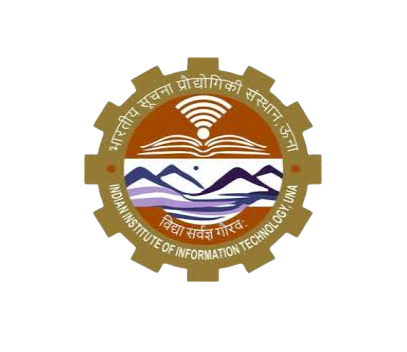

# IIIT Una Mess Management Project

<p align="center">

</p>

This is the repository for IIIT Una mess management.

## Local Development

For local development:

-   Clone the repo in your local enviroment

```sh
git clone https://github.com/akshatmittal61/mess-management.git
```

-   Enter into the directory

```sh
cd mess-management
```

-   Install the node modules

```sh
npm i
```

-   For the frontend (react server)

```sh
npm run react
```

-   For the backend (express and mongodb)

```sh
npm start
```

-   **Note:** For nodemon:

```sh
npm run server
```

## Authors

-   [Akshat Mittal](https://github.com/akshatmittal61)
-   [Akshat Khosya](https://github.com/akshat-khosya)
